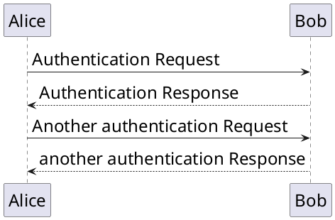

# Title
> example Title

## SubTitle
example SubTitle

## Example plantUML

```plantuml
@startuml
skinparam sequence {
ActorFontSize 24
ParticipantFontSize 24
GroupFontSize  24
ArrowFontSize 24
titleFontSize 24
}
Alice -> Bob: Authentication Request
Bob --> Alice: Authentication Response

Alice -> Bob: Another authentication Request
Alice <-- Bob: another authentication Response
@enduml
```

## Example emoji
:100:

## Example flexible alerts
> [!NOTE]
> An alert of type 'note' using global style 'callout'.